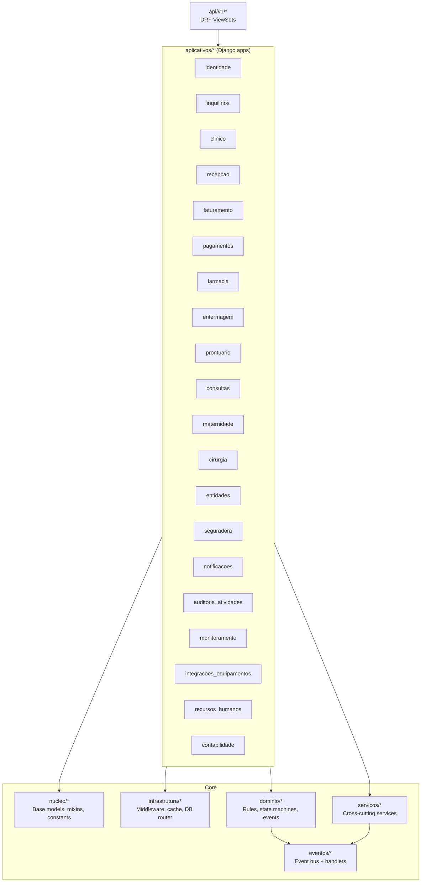

# SUBSTRATO (SUBS) System Blueprint

**System name:** SUBSTRATO  
**Acronym / slogan:** SUBS — *Sistema Unificado de Base em Saude*  
**Repository type:** Modular monolith (Django + DRF + Celery) with a separate Next.js web frontend  
**Primary language:** Portuguese (domain terminology, UI), with English-friendly structure in this blueprint  
**Generated:** 2026-03-15

---

## 1. System Overview

### Purpose of the system
SUBSTRATO is a digital infrastructure platform for healthcare operations, covering end-to-end workflows from reception (patient intake) to clinical/laboratory execution, nursing operations, pharmacy stock/sales, billing, payments, and reporting. It is designed to operate as a multi-tenant SaaS (multiple clinics/organizations sharing the same codebase with logical isolation by tenant).

### Core capabilities
- Multi-tenant foundation (tenant-aware models, middleware tenant resolution, per-tenant usage limits).
- Identity and access control (JWT auth + role-based access control enforced at the API router; Django Admin available to Administrators only).
- Patient management (demographics, documents, contacts, provenance, occupational medicine company linkage).
- Laboratory and clinical exam requisitions and result workflows (state machine: pendente -> em_analise -> aguardando_validacao -> validado).
- Cardex (Prontuario) with structured prescription items.
- Consultation scheduling with pricing rules (holiday surcharge configured per tenant).
- Nursing workflows including procedures/materials and ward management (enfermaria, beds, hospitalizations, next medication tracking).
- Pharmacy inventory (products, lots, FEFO stock movements) and sales.
- Billing (multi-origin invoices) and payments, with automatic receipt generation when fully paid.
- Document generation (A5 PDFs for requisition/results/invoice/receipt) with QR codes and Code128 barcodes.
- Audit and monitoring (persisted user activity logs and error logs, plus Prometheus metrics).
- Equipment integrations (worklist + results inbox HTTP JSON, authenticated by per-equipment API key).
- Dashboards and analytics with export (PDF/CSV/Word).

### Target users
- Administrador (system administrator)
- Recepcionista (front desk / reception)
- Tecnico de Laboratorio (result entry/validation)
- Enfermeiro (nursing procedures, ward operations)
- Medico / Medicina Ocupacional (clinical follow-up, requisitions, cardex)
- Tecnico de Farmacia (stock, lots, sales)
- Contabilidade (accounts/ledger, financial reconciliation, read-only billing history)
- Gestor de RH (employees and schedules)

### Domain context
- Clinic/laboratory setting (patient-centered workflows, exam catalogs, result validation, billing documents).
- Mozambican operational context is visible in defaults (Africa/Maputo timezone, MZN currency, NUIT fields, Portuguese naming).
- Occupational medicine support: patients can be linked to an originating company; requisitions can be requested/executed by external companies.

---

## 2. Repository Structure

The repository is a single workspace containing backend, frontend, infrastructure, scripts, and documentation.

### Top-level directories and responsibilities

| Path | Responsibility |
| --- | --- |
| `plataforma/` | Django project package: settings, WSGI/ASGI entrypoints, URL root, Celery app wiring. |
| `api/` | REST API implementation: `api/v1/` is the active DRF API; `api/endpoints/` contains legacy/unused endpoints. |
| `aplicativos/` | Main Django apps (bounded contexts): clinico, recepcao, faturamento, pagamentos, farmacia, enfermagem, prontuario, maternidade, cirurgia, consultas, contabilidade, identidade, inquilinos, entidades, seguradora, notificacoes, auditoria_atividades, monitoramento, integracoes_equipamentos, recursos_humanos. |
| `aplicacao/` | Application/use-case orchestration (service functions coordinating multiple apps, transactions, invariants). |
| `dominio/` | Domain rules and state machines (business logic that should remain framework-light). |
| `servicos/` | Cross-cutting services (billing, tenant usage limits, notifications, reports) used by apps/API. |
| `nucleo/` | Shared core building blocks: base models/mixins, constants/enums, value objects, ORM helpers. |
| `infrastrutura/` | Infrastructure concerns: middleware, cache, DB router, custom ORM fields, queue helpers, resilience utilities. |
| `eventos/` | In-process event bus and event handler registration; used to decouple domain actions. |
| `tarefas/` | Celery tasks and PDF generators (ReportLab), cleanup scripts, seeding helpers (some legacy). |
| `integracoes/` | External integration adapters (messaging, payments, government/insurance, HL7/FHIR stubs, storage stubs). |
| `frontend-next/` | Next.js 14 (App Router) frontend: pages, components, Tailwind, API client, RBAC UI. |
| `scripts/` | Operational scripts: backups, reset DB+migrations (dev), RBAC user creation wrapper, DB init SQL, schema conversion. |
| `kubernetes/` | Kubernetes manifests (base deployment/service/HPA, Postgres statefulset, configmap/secret, ingress). |
| `monitoring/` | Prometheus and Grafana provisioning/config for observability. |
| `observabilidade/` | Observability utilities (audit log helpers, metrics, health, logging helpers). |
| `templates/` | Django templates (mostly used by Admin/Jazzmin overrides, if any). |
| `static/` | Static assets (images/logo, CSS inputs, etc). |
| `staticfiles/` | Collected static output (runtime artifact). |
| `media/` | User uploads (profile photos, generated files) (runtime artifact). |
| `logs/` | Log files (runtime artifact; JSON/rotating logs). |
| `backups/` | Backup archives produced by scripts (runtime artifact). |
| `arquivos/`, `artefatos/` | Assets and previews (e.g., logos/images, PDF previews). |
| `sistema/`, `usuarios/`, `auditoria/`, `configuracao/` | Legacy/utility modules not part of primary Django apps; treat as internal tooling/tech debt unless referenced. |

### Key entrypoints and configuration files
- `manage.py`: standard Django entrypoint (defaults to `DJANGO_SETTINGS_MODULE=plataforma.settings`).
- `plataforma/urls.py`: routes `/admin/`, `/api/`, `/pdf/`, OpenAPI docs, and health probes.
- `plataforma/settings/base.py`: installed apps, middleware, DB/cache/JWT/email/notifications settings.
- `docker-compose.yml`, `docker-compose.prod.yml`: dev/prod container topology.
- `Dockerfile`, `Dockerfile.frontend`, `entrypoint.sh`: container build and startup logic.
- `frontend-next/next.config.js`: reverse proxy rewrites and trailing slash handling.
- `.github/workflows/*.yml`: CI (tests, lint, docker build, deploy skeleton).

---

## 3. Architecture

### Architectural style
- **Modular monolith**: all business modules are Django apps inside one backend runtime.
- **Layered / DDD-inspired separation (intended)**.
- Domain: `dominio/` holds business rules/state machines.
- Application: `aplicacao/` orchestrates use-cases across aggregates.
- Apps: `aplicativos/` contains persistence models and app-local behavior.
- Services: `servicos/` provides cross-module services.
- Infrastructure: `infrastrutura/` handles cross-cutting technical concerns.
- **Event-driven inside the monolith**: an in-process event bus is used to publish domain events after DB commits.
- **Async processing**: Celery workers run tasks (PDF generation, cleanup, future notification fan-out).
- **Multi-tenant**: tenant context is resolved per request and used in models, queries, and usage limits.

### Core components
- **Web frontend**: Next.js (App Router) + Tailwind + RBAC-aware navigation and CRUD screens.
- **API backend**: Django + DRF, OpenAPI via drf-spectacular, JWT via SimpleJWT.
- **Admin backend**: Django Admin with Jazzmin theme + custom Tailwind CSS overlay.
- **Datastores**: Postgres 15 (primary); SQLite fallback for local dev when Postgres is unavailable (DEBUG); Redis 7 (cache and Celery broker/result backend).
- **Observability**: `/health/live`, `/health/ready`, django-prometheus `/metrics`, persisted audit and error logs.

### Service boundaries
Boundaries are expressed as Django apps (e.g., `clinico`, `faturamento`, `pagamentos`). They remain deployable as one backend process but are organized to reduce coupling.

### Dependency relationships (intended)
- `api/v1/*` depends on serializers/viewsets that depend on `aplicativos/*` models and `aplicacao/*` use-cases.
- `aplicativos/*` models depend on `nucleo/*` and sometimes call `dominio/*` rules.
- `dominio/*` should be mostly independent and imported by apps/services.
- `infrastrutura/*` is referenced by settings/middleware and core model mixins (tenant/user context, cache).
- `eventos/*` can be triggered from domain/app code and then handled by services/apps.

### Notable tech debt (architectural)
- Legacy/unused code exists under `api/endpoints/` and some files in `tarefas/` that import non-existent modules (likely old prototypes). These should be quarantined or removed to reduce confusion.
- Naming is mixed (`modelos/` vs `models/` in some apps; `infrastrutura` spelling), which affects discoverability.

---

## 4. Backend Architecture

### Frameworks and libraries used
- Django 4.2 + Django REST Framework
- Authentication: SimpleJWT (JWT access/refresh), custom user model (`AUTH_USER_MODEL=identidade.Usuario`)
- OpenAPI: drf-spectacular (`/api/schema/`, `/api/docs/`, `/api/redoc/`)
- Async: Celery 5.4 + django-celery-beat + Redis
- Observability: django-prometheus, structured logging, persisted audit/error models
- Documents: ReportLab + qrcode + barcode Code128
- Admin UI: Jazzmin + custom CSS generated by Tailwind

### Dependency inventory (selected)

Backend (Python, `requirements.txt`):

| Package | Purpose | Version |
| --- | --- | --- |
| `Django` | Web framework | `4.2.16` |
| `djangorestframework` | REST API framework | `3.16.1` |
| `djangorestframework_simplejwt` | JWT auth | `5.5.1` |
| `drf-spectacular` | OpenAPI schema + docs | `0.29.0` |
| `celery` | Async task queue | `5.4.0` |
| `redis` | Redis client (cache/broker) | `7.2.1` |
| `django-redis` | Django cache backend for Redis | `6.0.0` |
| `django-celery-beat` | DB-backed periodic tasks | `2.6.0` |
| `django-prometheus` | Prometheus metrics for Django | `2.3.1` |
| `reportlab` | PDF generation | `4.4.7` |
| `qrcode` | QR code generation | `8.2` |
| `pillow` | Image processing (logos, uploads) | `12.1.0` |
| `psycopg` / `psycopg-binary` | Postgres driver | `3.3.2` |
| `requests` | HTTP client (integrations) | `2.32.3` |
| `whitenoise` | Static file serving in Django | `6.11.0` |
| `python-dotenv` | `.env` loading | `1.2.1` |

Frontend (Node, `frontend-next/package.json`):

| Package | Purpose | Version range |
| --- | --- | --- |
| `next` | Frontend framework (App Router) | `^14.0.0` |
| `react` / `react-dom` | UI runtime | `^18.2.0` |
| `tailwindcss` | Styling | `^3.4.17` |
| `axios` | HTTP client | `^1.6.0` |
| `@tanstack/react-query` | Server state/query cache | `^5.90.21` |
| `zustand` | Client state | `^4.4.0` |
| `zod` | Runtime validation | `^4.3.6` |
| `recharts` | Charts | `^2.15.4` |
| `lucide-react` | Icons | `^0.263.0` |
| `vitest` | Unit tests | `^1.0.0` |

Note on optional dependencies: `requirements.txt` includes packages such as `django-axes`, `django-import-export`, `django-select2`, `django-simple-history`, `crispy-bootstrap5`, and others that are not currently configured in `INSTALLED_APPS` in `plataforma/settings/base.py`. Treat them as optional/future until explicitly wired.

### Domain layer (`dominio/`)
- Clinical result state machine (`ResultadoStateMachine`) enforcing allowed transitions.
- Clinical result interpretation service (`ServicoResultado`) computing status symbols/colors/critical alerts using patient-aware reference resolution.
- Domain events (e.g., `ResultadoValidadoEvent`) published after commit.

### Services layer (`aplicacao/` and `servicos/`)
- Use-case orchestration is implemented as transactional functions.
- Example: reception workflow in `aplicacao/recepcao/fluxo_atendimento.py` orchestrates check-in -> requisition -> invoice -> payment -> receipt.
- Tenant usage/rate limiting service (`servicos/inquilinos/tenant_usage_service.py`) updates Redis counters.

### Infrastructure layer (`infrastrutura/`)
- Tenant resolution middleware (`InquilinoMiddleware`) in DEBUG: auto-selects/creates a local tenant to avoid null tenant issues.
- Tenant resolution middleware (`InquilinoMiddleware`) in production: resolves tenant by Host domain; equipment integrations can also set tenant via `X-Integration-Key`.
- User context middleware (`RequestUserMiddleware`) stores current user in a `ContextVar` for auditing/soft-delete attribution.
- Rate limiting middleware (`TenantLimitMiddleware`) applies per-tenant monthly limits (plan-based) using Redis atomic increments.
- `TenantAuditMiddleware` persists activity to DB and logs structured events.
- `ErrorCaptureMiddleware` persists uncaught exceptions to DB for monitoring.
- DB router (`TenantDatabaseRouter`) provides optional tenant sharding support (default single DB).
- Cache wrapper (`TenantCache`) namespaces cache keys by tenant and supports atomic increments in Redis.

### API layer (`api/v1/`)
- DRF `DefaultRouter` with `trailing_slash="/?"` and a central `registrar_rotas(router)` that registers all ViewSets and enforces RBAC.
- Custom exception handler implements RFC 7807-like responses and converts Django `ValidationError` into DRF-friendly 400 payloads.
- Key API groups: clinico, recepcao, faturamento, pagamentos, farmacia, enfermagem, consultas, prontuario, maternidade, cirurgia, entidades, seguradora, contabilidade, recursos_humanos, notificacoes, auditoria, monitoramento, dashboard, inquilinos.
- Auth endpoints: `/api/v1/auth/login/`, `/api/v1/auth/refresh/`, `/api/v1/auth/logout/`, `/api/v1/auth/user/`.
- Password reset endpoints: `/api/v1/auth/password-reset/request/`, `/api/v1/auth/password-reset/confirm/`.
- Password change endpoint: `/api/v1/auth/password/change/`.

---

## 5. Data Architecture

### Database technologies
- **Primary relational database:** PostgreSQL (compose/k8s defaults).
- **Development fallback:** SQLite (`db.sqlite3`) when Postgres is not reachable in DEBUG.
- **Cache and queues:** Redis (Django cache backend in production; Celery broker/result backend).

### Multi-tenant data isolation model
- Most business models inherit from `CoreModel` or `NoNameCoreModel`, which include `inquilino` (tenant scope), `id_custom` (prefixed identifier), audit fields (created/updated by/time), versioning, and soft delete flags.
- `InquilinoMiddleware` ensures `request.inquilino` is set; `InquilinoMixin.save()` defaults `inquilino` from context when missing.
- Many uniqueness constraints are conditional on `deletado=False` to preserve history while allowing re-creation.

### Key entities and relationships (high level)

| Aggregate / entity | Key relationships (simplified) |
| --- | --- |
| Tenant (`Inquilino`) | 1-1 `ConfiguracaoInquilino`, 1-N `AssinaturaTenant`, 1-N all tenant-scoped entities |
| User (`Usuario`) | belongs to `Inquilino`; many-to-many `Group`; optional profile photo |
| Patient (`Paciente`) | belongs to `Inquilino`; optional `Empresa` origin; 1-N requisitions, invoices, consultations, nursing records, ward admissions |
| Exam catalog (`Exame`, `ExameCampo`) | belongs to `Inquilino`; `Exame` 1-N `ExameCampo` |
| Requisition (`RequisicaoAnalise`) | belongs to `Inquilino`; FK `Paciente`; through `RequisicaoItem` to `Exame` or `ExameMedico`; 1-1 `Resultado`; 1-1 `Fatura` (clinical origin) |
| Result (`Resultado`, `ResultadoItem`) | `Resultado` 1-1 `RequisicaoAnalise`; `ResultadoItem` belongs to `Resultado` + `ExameCampo`; state machine transitions and validation audit |
| Invoice (`Fatura`, `FaturaItem`, `HistoricoFatura`) | `Fatura` references exactly one origin (clinical requisition, pharmacy sale, nursing procedure(s), or consultation); items inherit IVA from referenced catalog items; totals stored and recalculated |
| Payment (`Pagamento`) | FK `Fatura`; transitions update invoice status; on full payment triggers receipt generation |
| Receipt (`Recibo`) | FK `Fatura`, 1-1 with `Pagamento` that closed the invoice; used to generate separate PDF document |
| Pharmacy (`Produto`, `Lote`, `MovimentoEstoque`, `Venda`, `ItemVenda`) | lots track initial quantity and compute saldo via movements; `ItemVenda` consumes stock FEFO and updates sale totals; invoices can sync from sales |
| Ward (`Enfermaria`, `CamaEnfermaria`, `InternamentoEnfermaria`) | bed occupancy enforced (one active admission per bed); dashboard and next medication fields supported |
| Cardex (`RegistroProntuario`, `PrescricaoItem`) | FK patient + doctor; M2M consultations; structured medication dosage, units, interval/doses rules |
| Occupational medicine (`Empresa`) | linked from patient and requisitions (solicitante/executora externa) |
| Audit/Monitoring | `AtividadeUsuario` persists API/admin/pdf actions; `ErroSistema` persists unhandled exceptions (scoped by tenant) |

### Data invariants implemented in code (examples)
- Tenant consistency checks between linked objects (patient/requisition/results, invoice/origin, stock movements/lots).
- Immutability after terminal state transitions (e.g., finalized requisitions/results; emitted invoices).
- Stock movements disallow expired lots and enforce sufficient saldo on outputs.

---

## 6. System Modules

This section maps the functional modules to the codebase and explains interactions.

### Authentication and users
- App: `aplicativos/identidade`
- API: `api/v1/auth/*`, `api/v1/identidade/*`
- Model: `identidade.Usuario` extends `AbstractUser` plus corporate fields (`nome`, `telefone`, `foto`, tenant scope).
- Password reset and profile updates are implemented as API endpoints; notifications can send reset codes via email/WhatsApp when configured.

### Tenants (multi-tenant SaaS)
- App: `aplicativos/inquilinos`
- Infra: `infrastrutura/middleware/inquilino.py`, `nucleo/mixins/escopo_inquilino.py`
- Features: plans, subscriptions, feature flags, per-tenant usage/limits.

### Reception (check-in workflow)
- App: `aplicativos/recepcao`
- Use-case: `aplicacao/recepcao/fluxo_atendimento.py`
- Interaction: creates `CheckinRecepcao`, then `RequisicaoAnalise`, then `Fatura`, then `Pagamento` and `Recibo`.

### Clinical/Lab (patients, requisitions, results)
- App: `aplicativos/clinico`
- API: `api/v1/clinico/*`
- Interaction: reception and doctors create requisitions; laboratory enters results and validates them; validation updates requisition state and can trigger downstream actions (events, finalization).

### Consultations (appointments)
- App: `aplicativos/consultas`
- Features: scheduled consultations, medical professional assignment, specialty-based pricing, holiday surcharge (`Feriado` + tenant config).
- Billing integration: `Fatura` can be created with origin `CONSULTA` and syncs an invoice item from consultation price.

### Cardex (Prontuario)
- App: `aplicativos/prontuario`
- Features: clinical notes (symptoms, diagnosis, report) and structured prescription items (medication, dosage unit, interval/doses rules).
- Interaction: patient "historia clinica" API aggregates cardex + requisitions + consultations + nursing + ward admissions + pharmacy + invoices/receipts.

### Nursing and ward management
- App: `aplicativos/enfermagem`
- Features: nursing records, vital signs, prescriptions, procedures (catalog + items + materials), ward/beds/admissions, ward dashboard endpoints.
- Billing integration: invoices can sync from performed procedures/materials; stock consumption integrates with pharmacy lots.

### Pharmacy
- App: `aplicativos/farmacia` (note: uses `models/` subpackage, unlike most apps using `modelos/`)
- Features: products and lots, FEFO stock consumption via movements, sales and sale items, invoice sync from sales.

### Billing and payments
- Apps: `aplicativos/faturamento`, `aplicativos/pagamentos`
- Features: multi-origin invoices, computed totals and IVA, emission immutability, payment transitions, automatic receipt creation on full payment.
- Documents: invoice and receipt PDFs are generated with barcode/QR and item-level details.

### Accounting
- App: `aplicativos/contabilidade`
- Features: accounts, journal entries, reconciliation, ledger-like records (details vary by model set).
- Interaction: consumes read-only financial data from invoices/payments; can register accounting entries.

### External entities and insurance
- Apps: `aplicativos/entidades`, `aplicativos/seguradora`
- Features: external companies (NUIT, contacts, banking details) and insurer plan/authorization models.
- Interaction: requisitions and patient profiles can reference companies; billing can later incorporate insurer splits.

### Notifications
- App: `aplicativos/notificacoes`
- Integrations: `integracoes/mensageria/*`
- Features: templates, logs, idempotent delivery by external reference, channel enable/disable by settings.

### Monitoring and audit
- Apps: `aplicativos/monitoramento`, `aplicativos/auditoria_atividades`
- Infra: middleware persists errors and activity; Prometheus metrics are exposed.

### Equipment integrations
- App: `aplicativos/integracoes_equipamentos`
- API: `/api/v1/integracoes/equipamentos/<equipamento_id_custom>/(worklist|resultados)`
- Auth: `X-Integration-Key` validated against `IntegracaoCredencial` (hashed with server pepper).
- Features: worklist order retrieval, result ingestion, analyte mapping, document attachments, message idempotency.

### Dashboard and analytics
- API: `api/v1/dashboard/*`
- Frontend: `frontend-next/app/estatisticas`
- Features: KPIs + Top N stats across modules with export to PDF/CSV/Word.

---

## 7. External Integrations

### Implemented integrations (actively used)
- Email notifications via Django `send_mail` (configurable SMTP/console backend).
- WhatsApp and SMS adapters using HTTP requests to configured provider URLs.
- Equipment integrations (HTTP JSON) for worklist and results inbox using API key auth.

### Partially implemented / stubs (present in repo but not fully wired)
- Payment gateways under `integracoes/pagamentos/` (Mpesa/e-Mola/mKesh/Stripe/PayPal) show intended direction, but there are inconsistencies (missing base classes/imports) indicating unfinished integration wiring.
- Laboratory standards stubs: HL7/FHIR placeholders under `integracoes/laboratorio/`.
- Government and insurer stubs under `integracoes/governo/` and `integracoes/seguradoras/`.
- Object storage stubs under `integracoes/armazenamento/` (S3/Backblaze).

### Messaging systems and async
- Celery with Redis broker/result backend is the primary async mechanism.
- The in-process event bus supports `publish_after_commit` and can be extended to dispatch background tasks instead of synchronous handlers.

---

## 8. System Flows

### Patient registration (reception)
1. Reception creates a `Paciente` (tenant-scoped).
2. Optional: link patient to `Empresa` (occupational medicine).
3. Patient becomes available to requisitions, consultations, ward admissions, and billing.

### Reception operational flow (check-in -> requisition -> invoice -> payment -> receipt)
1. Create `CheckinRecepcao` (arrival/priority/motivo).
2. Create `RequisicaoAnalise` with `RequisicaoItem` for selected exams.
3. Create `Fatura` for the requisition and `sincronizar_itens_da_origem()` to populate `FaturaItem`s.
4. Emit invoice (`Fatura.emitir()`).
5. Register payment (`Pagamento.confirmar()`).
6. Invoice state updates to `PAGA` when fully paid and triggers `gerar_recibo_automatico()`.

### Laboratory flow (results lifecycle)
1. A requisition creates a `Resultado` with `ResultadoItem`s generated from `ExameCampo`s.
2. Laboratory performs the workflow in order: `lancar` (start entry) -> `gravar` (save measured values; auto-interpretation runs) -> `validar` (requires non-empty values; sets validator and timestamp).
3. On validation, an event (`ResultadoValidadoEvent`) is published after commit.
4. Requisition status is recalculated and transitions automatically to `VALIDADO` when all items are validated; `Resultado.finalizado` is set accordingly.

### Consultation scheduling and pricing
1. Create `ConsultaMedica` linked to patient and doctor.
2. Select `EspecialidadeConsulta` to auto-fill `tipo` and base price.
3. If date is a holiday (`Feriado`), apply tenant-configured surcharge percentage.
4. Billing can create a `Fatura` with origin `CONSULTA`.

### Pharmacy sale and stock flow
1. Create `Venda`.
2. Add `ItemVenda` referencing `Produto` and quantity.
3. FEFO stock consumption chooses available lots (`Lote.disponiveis(produto)`) ordered by expiry and creates `MovimentoEstoque` outputs to deduct saldo.
4. Billing can sync invoice items from the sale.

### Ward (enfermaria) flow
1. Configure `Enfermaria` and `CamaEnfermaria`.
2. Create `InternamentoEnfermaria` assigning a patient to a bed; enforce one active admission per bed.
3. Track next medication schedule in the admission record; dashboard endpoints aggregate occupancy and next medication times.

### Clinical history aggregation
The patient history endpoint aggregates records across modules (cardex, requisitions, consultations, nursing, ward admissions, pharmacy, invoices, receipts). When available, linking can be done by shared patient document number for continuity.

---

## 9. Deployment Architecture

### Containers (Docker Compose)
Development (`docker-compose.yml`) provides:
- `db`: Postgres 15
- `redis`: Redis 7
- `backend`: Django + Gunicorn
- `frontend`: Next.js
- `celery`: worker
- `celery_beat`: scheduler
- `nginx`: reverse proxy (optional in dev)

Production (`docker-compose.prod.yml`) provides:
- `traefik`: edge router with Let's Encrypt
- `backend`, `frontend`
- `celery`, `celery_beat`
- `redis`, `db`
- `prometheus`, `grafana`, `celery_exporter`

### Kubernetes (manifests under `kubernetes/base/`)
- Backend Deployment + Service + HPA, using `/health/live` and `/health/ready` probes.
- Postgres StatefulSet with PVC for storage.
- ConfigMap/Secret for environment configuration.
- Ingress definition for API and frontend hostnames.

### Environment configuration (high level)
- Django: `DJANGO_SECRET_KEY`, `DJANGO_ALLOWED_HOSTS`, `DJANGO_DEBUG`, `DJANGO_ENV`, `DJANGO_SETTINGS_MODULE`.
- DB: `DB_ENGINE`, `DB_NAME`, `DB_USER`, `DB_PASSWORD`, `DB_HOST`, `DB_PORT`.
- Redis: `REDIS_URL`.
- CORS/CSRF: `CORS_ALLOWED_ORIGINS`, `CSRF_TRUSTED_ORIGINS` (important when proxying admin through Next.js).
- Notifications: SMTP settings + `NOTIFICACOES_*` flags + provider URLs/keys.
- Security: `SUBSTRATO_SUPERUSER_ALLOWLIST` controls who can remain superuser.

---

## 10. Development Guide

### How to run the system (local, without Docker)
1. Create venv and install backend deps.
2. Set env vars (at minimum `DJANGO_SECRET_KEY`, optional DB/Redis).
3. Run migrations and start Django.
4. Start Celery worker/beat if needed.
5. Start Next.js dev server in `frontend-next/`.

### How to run the system (Docker)
- `docker compose up --build`
- Backend: `http://localhost:8000`
- Frontend: `http://localhost:3000`

### Developer workflow
- API-first: OpenAPI schema is served at `/api/schema/` and can be generated into `frontend-next/schema.json` via `generate_schema.py` or Makefile target `make schema`.
- Frontend forms: `frontend-next/lib/openapi/formBuilder.ts` builds CRUD forms from the schema and includes read-only fields for transparency.
- Admin styling: `frontend-next` can generate CSS for Django Admin (`npm run build:admin-css`) and it is referenced in Jazzmin settings.

### Testing strategy
- Backend: `pytest` (pytest-django) plus `python manage.py test` is available.
- Frontend: `vitest`.
- CI: GitHub Actions runs ruff (lint/format), backend tests, and frontend build/tests.

### Coding standards and tooling
- Python lint/format: Ruff (`pyproject.toml`).
- TypeScript lint: Next.js ESLint.
- Prefer tenant-scoped queries and enforce invariants in `clean()` / `save()` for aggregates.

### Common troubleshooting
- `ModuleNotFoundError: django_celery_beat`: install backend dependencies (`pip install -r requirements.txt`) or use Docker where dependencies are baked in.
- Trailing slash redirect loops: Next.js is configured with `trailingSlash: true` and rewrite normalization; DRF router also accepts optional trailing slash.
- Superuser "disappearing": the user model enforces `SUPERUSER_ALLOWLIST`; if username is not allowed, it is downgraded from superuser on save.
- Tenant not found (production): tenant is resolved by Host header; ensure DNS/domains match `Inquilino.dominio`.

---

## 11. Scalability Strategy

### Multi-clinic / multi-tenant growth
- Keep tenant isolation strict: ensure every business query is scoped by `inquilino`, and consider DB-level constraints and Postgres row-level security (RLS) for defense-in-depth.
- Tenant configuration (`ConfiguracaoInquilino`) can evolve to support multi-unit branches (`permite_multi_unidade`) and per-unit reporting.

### Horizontal scaling
- Backend is largely stateless (JWT auth + DB/Redis state), so it scales with additional Gunicorn replicas.
- Celery workers scale independently for heavy tasks (PDF generation, bulk notifications, integration ingestion).
- Frontend scales via standard Node/Next deployment patterns (or static + edge where possible).

### High data volume considerations
- Partitioning or time-based archiving candidates: `ResultadoItem` (lab results), `AtividadeUsuario` and `ErroSistema` (audit/monitoring), notification logs.
- Add/verify indexes on high-cardinality tenant/time columns; prefer composite indexes `(inquilino, criado_em)` for time-range queries.
- Consider moving large binaries (documents/images) to object storage (S3-compatible) and store references in DB.

### Database scaling
- Current code includes an optional `TenantDatabaseRouter` that can route reads/writes to tenant shards if additional DBs are configured.
- For production scale, prefer connection pooling (PgBouncer), read replicas for analytics/reporting, and async task offloading for heavy aggregates and exports.

### Observability at scale
- Use Prometheus metrics + Grafana dashboards as baseline.
- Add tracing (OpenTelemetry) if cross-service integrations become significant.
- Keep structured logs consistent (JSON format already configured).

---

## 12. Diagrams

### System architecture (runtime)

```mermaid
flowchart LR
  U[Users / Staff] --> B[Browser]
  B --> N[Next.js Frontend\nfrontend-next]
  N -->|/api/v1/*| A[Django + DRF API\nplataforma + api/v1]
  N -->|/admin/* (proxy)| ADM[Django Admin\nJazzmin + Tailwind CSS]
  A --> PG[(PostgreSQL)]
  A --> R[(Redis)]
  A -->|publish_after_commit| EB[In-process EventBus\n(eventos/bus.py)]
  A -->|enqueue| C[Celery Worker]
  C --> R
  C --> PG
  A -->|/metrics| P[Prometheus]
  P --> G[Grafana]

  EI[Equipment] -->|HTTP JSON + X-Integration-Key| A
  A -->|Email/SMS/WhatsApp| MSG[Messaging Providers]
```

### Module relationships (backend bounded contexts)



### Data flow (reception + lab + billing)

```mermaid
sequenceDiagram
  autonumber
  participant R as Recepcao UI (Next.js)
  participant API as API (Django/DRF)
  participant DB as Postgres
  participant L as Laboratorio UI (Next.js)
  participant PDF as PDF Generator (ReportLab)

  R->>API: Create Paciente
  API->>DB: INSERT Paciente
  R->>API: Create RequisicaoAnalise + itens (Exame ids)
  API->>DB: INSERT RequisicaoAnalise, RequisicaoItem, Resultado, ResultadoItem*
  R->>API: Create Fatura (origem=CLINICO) + emitir
  API->>DB: INSERT Fatura, FaturaItem(s), HistoricoFatura; update totals/state

  L->>API: Lancar/Gravar resultados (ResultadoItem)
  API->>DB: UPDATE ResultadoItem (valor, interpretacao)
  L->>API: Validar resultados (ResultadoItem -> VALIDADO)
  API->>DB: UPDATE ResultadoItem (validado_por, data_validacao, estado)
  API->>DB: UPDATE RequisicaoAnalise.estado = VALIDADO (when all items validated)

  R->>API: Registrar Pagamento (confirmar)
  API->>DB: INSERT Pagamento; UPDATE Fatura.estado; INSERT/UPDATE Recibo

  R->>API: GET /pdf/* (Fatura/Recibo/Resultados)
  API->>PDF: Render A5 PDF with QR + barcode
  PDF-->>R: PDF bytes
```
