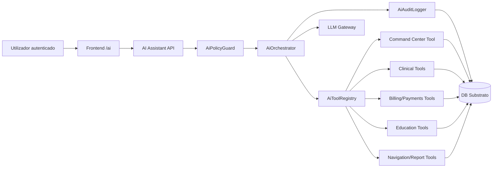
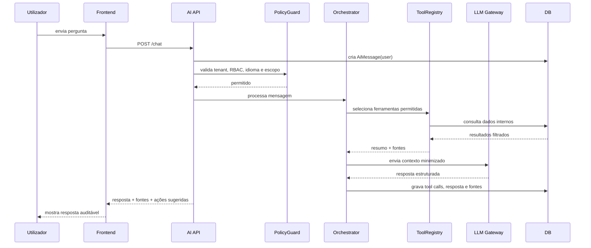
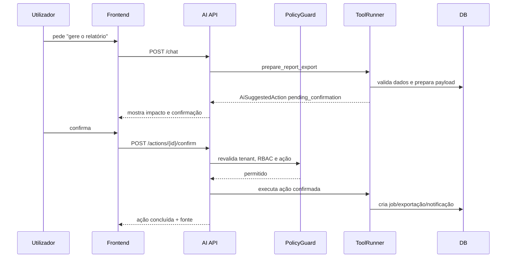

# IA Operacional do Substrato

## Estado
Proposta técnica implementável.

Este documento define a estrutura base da IA do Substrato. A intenção não é criar um chatbot genérico, mas uma camada operacional segura que entende o domínio do sistema, respeita as permissões existentes e transforma dados dispersos em orientação prática para utilizadores autorizados.

## Decisão Central
A primeira versão da IA deve ser um **copiloto operacional em modo leitura**, integrado ao Command Center e aos módulos principais do projeto.

Escrita, notificações, exportações, tarefas e qualquer ação com impacto operacional devem ser tratadas como **ações preparadas**, nunca executadas diretamente pela resposta do modelo. A execução só acontece depois de confirmação explícita do utilizador e nova validação de RBAC/tenant no backend.

## Objetivos
1. Reduzir o tempo para encontrar informação operacional.
2. Explicar alertas, erros, atrasos e filas de trabalho em linguagem compreensível.
3. Apoiar relatórios executivos, clínicos, financeiros e escolares.
4. Ajudar utilizadores a navegar para a página certa com filtros já preparados.
5. Preservar segurança clínica, financeira e multi-tenant.
6. Criar uma base auditável para futuras automações.

## Não Objetivos
1. Substituir profissionais clínicos, financeiros ou administrativos.
2. Diagnosticar, prescrever ou validar resultados clínicos autonomamente.
3. Confirmar pagamentos, apagar dados ou alterar registos sem confirmação.
4. Expor dados de um tenant a outro tenant.
5. Treinar modelos externos com dados sensíveis do projeto.
6. Criar automação invisível sem trilha de auditoria.

## Princípios Obrigatórios
1. **Tenant primeiro**: todo acesso a dados recebe `tenant` resolvido pelo middleware.
2. **Permissões do utilizador**: a IA nunca deve ter mais acesso do que o utilizador autenticado.
3. **Auditoria por defeito**: sessão, mensagem, ferramenta, erro, política e ação devem ser registados.
4. **Fontes internas**: respostas factuais devem apontar os dados internos usados.
5. **Minimização de dados**: enviar ao modelo apenas o necessário para responder.
6. **Ação em duas fases**: preparar primeiro, confirmar depois.
7. **Explicabilidade operacional**: a IA deve dizer o que encontrou, onde encontrou e qual é a limitação.
8. **Idioma persistente**: PT-PT e EN devem seguir a preferência do utilizador.

## Relação com a Arquitetura Atual
A IA deve aproveitar superfícies já existentes no Substrato:

- Multi-tenant: `TenantMiddleware` e modelos com `tenant`.
- RBAC: grupos, permissões e viewsets protegidos.
- Auditoria: `UserActivity` e logs de atividade.
- Monitorização: `SystemError`, telemetria e Command Center.
- Eventos: outbox/eventos operacionais já definidos para a evolução do sistema.
- Frontend: Next.js em `frontend-next`, `AppLayout`, `useLanguage`, `apiFetch`, componentes `Card`, `MetricCard`, `DataTable`.

## Arquitetura de Alto Nível


## Camadas
### Frontend
Responsável pela experiência do utilizador, contexto visual, confirmação de ações e exibição de fontes.

Local sugerido:
- `frontend-next/app/ai/page.tsx`
- `frontend-next/components/ai/`
- `frontend-next/lib/ai/`

Componentes sugeridos:
- `AiChatPanel`: conversa principal.
- `AiComposer`: entrada de texto, anexos futuros e comandos rápidos.
- `AiContextPanel`: tenant, módulo ativo, idioma, permissões e escopo.
- `AiToolTrace`: ferramentas usadas, duração e estado.
- `AiSources`: links internos e objetos consultados.
- `AiSuggestedActions`: ações preparadas aguardando confirmação.
- `AiActionConfirmDialog`: confirmação e impacto antes de executar.
- `AiSafetyNotice`: bloqueios, falta de permissão e limites clínicos/financeiros.

### API
Responsável por receber mensagens, validar contexto, persistir sessão e acionar orquestração.

Local sugerido:
- `apps/ai_assistant/`
- `api/v1/ai/`

Endpoints iniciais:
- `POST /api/v1/ai/assistant/chat/`
- `GET /api/v1/ai/assistant/sessions/`
- `GET /api/v1/ai/assistant/sessions/{id}/`
- `POST /api/v1/ai/assistant/actions/{id}/confirm/`
- `POST /api/v1/ai/assistant/actions/{id}/cancel/`
- `GET /api/v1/ai/assistant/tools/`

### Orquestração
Responsável por decidir quais ferramentas usar, montar contexto seguro e produzir resposta final.

Serviços:
- `AiOrchestrator`
- `AiPolicyGuard`
- `AiToolRegistry`
- `AiToolRunner`
- `AiResponseBuilder`
- `AiAuditLogger`
- `AiContextBuilder`
- `LlmGateway`

### Ferramentas
Cada ferramenta deve ser uma classe pequena, testável e explicitamente registrada.

Contrato base:
```python
class AiTool:
    name: str
    description: str
    required_groups: tuple[str, ...]
    mode: Literal["read", "prepare_action", "write_confirmed"]

    def run(self, *, tenant, user, arguments: dict) -> dict:
        ...
```

Regras:
1. Ferramentas recebem `tenant` e `user`, nunca resolvem por conta própria.
2. Ferramentas usam querysets já filtrados por tenant.
3. Ferramentas retornam payload resumido e fontes internas.
4. Ferramentas não retornam campos sensíveis quando não forem necessários.
5. Ferramentas de escrita só rodam no endpoint de confirmação.

## Modelo de Dados
### `AiSession`
Campos:
- `tenant`
- `user`
- `title`
- `language`
- `active_module`
- `status`: `active`, `closed`, `archived`
- `created_at`
- `updated_at`
- `last_message_at`

Índices:
- `(tenant, user, updated_at)`
- `(tenant, status, updated_at)`

### `AiMessage`
Campos:
- `session`
- `role`: `user`, `assistant`, `system`, `tool`
- `content`
- `content_redacted`
- `metadata`
- `token_input_count`
- `token_output_count`
- `created_at`

Índices:
- `(session, created_at)`
- `(session, role, created_at)`

### `AiToolCall`
Campos:
- `session`
- `message`
- `tool_name`
- `mode`
- `input_redacted`
- `output_summary`
- `sources`
- `status`: `pending`, `success`, `blocked`, `error`
- `duration_ms`
- `error_message`
- `created_at`

Índices:
- `(session, tool_name, created_at)`
- `(status, created_at)`

### `AiSuggestedAction`
Campos:
- `session`
- `created_by`
- `action_type`
- `payload`
- `payload_redacted`
- `status`: `pending_confirmation`, `confirmed`, `cancelled`, `expired`, `failed`
- `requires_confirmation`
- `confirmation_summary`
- `confirmed_by`
- `confirmed_at`
- `executed_at`
- `result_summary`

Índices:
- `(tenant, status, created_at)`
- `(session, status, created_at)`

### `AiPolicyEvent`
Campos:
- `session`
- `user`
- `severity`: `info`, `warning`, `critical`
- `policy_key`
- `reason`
- `blocked`
- `metadata`
- `created_at`

Índices:
- `(tenant, severity, created_at)`
- `(tenant, policy_key, created_at)`

## Fluxo de Chat


## Fluxo de Ação com Confirmação


## Ferramentas Iniciais
### Command Center
`get_command_center_alerts`
- Fonte: `GET /api/v1/monitoring/telemetry/command_center/`
- Uso: explicar alertas, módulos abaixo do SLO, rotas 5xx e outbox.
- Permissões: administradores e perfis operacionais autorizados.

`get_module_health`
- Fonte: telemetria por módulo.
- Uso: responder "qual módulo está pior?", "o que está abaixo da meta?".

`get_error_summary`
- Fonte: `SystemError` e `UserActivity`.
- Uso: sumarizar erros por rota, status, utilizador e período.

### Clínico
`search_patients`
- Procura paciente por nome, código, documento ou telefone quando autorizado.
- Retorna lista curta, nunca histórico completo.

`get_patient_operational_summary`
- Retorna resumo clínico operacional com consultas, requisições, resultados e faturas relacionadas.
- Exige permissão clínica.

`search_lab_requests`
- Filtra por estado, prioridade, período, paciente e crítico.

`get_lab_request_collection_guidance`
- Explica exames solicitados, amostra, frasco/tubo e volume mínimo quando os dados existirem.

### Enfermagem
`get_nursing_pending_work`
- Lista colheitas, procedimentos e tarefas pendentes.

`prepare_nursing_task_assignment`
- Prepara tarefa para equipa ou profissional.
- Não executa sem confirmação.

### Financeiro
`search_invoices`
- Consulta faturas por estado, paciente, período e valor.

`search_payments`
- Consulta pagamentos e reconciliações.

`prepare_billing_report`
- Prepara relatório financeiro.
- Confirmação obrigatória para exportar.

### Farmácia
`search_pharmacy_stock`
- Consulta produtos, lotes, disponibilidade e validade.

`get_material_request_status`
- Mostra requisições de material e estado de atendimento.

### Educação
`get_education_summary`
- Resume estudantes, matrículas, turmas, avaliações e alertas escolares quando autorizados.

### Navegação
`prepare_filtered_navigation`
- Gera uma rota interna com filtros.
- Exemplo de resultado:
```json
{
  "href": "/laboratory/requests?critical=critical&status=awaiting_validation",
  "label_pt": "Abrir requisições críticas",
  "label_en": "Open critical requests"
}
```

## Política de Dados
### Dados que podem ser enviados ao LLM
- Contagens agregadas.
- Estados operacionais.
- Resumos redigidos.
- IDs internos quando necessários para citar fonte.
- Textos de erro resumidos.
- Metadados não sensíveis.

### Dados que exigem minimização
- Nome completo de paciente.
- Documento de identificação.
- Telefone.
- Email.
- Endereço.
- IP.
- Dados de pagamento.
- Notas clínicas livres.
- Resultado laboratorial textual completo.

### Dados bloqueados por defeito
- Segredos.
- Tokens.
- Passwords.
- Chaves de API.
- Dados de outro tenant.
- Payload bruto de request.
- Traceback completo enviado ao provedor externo.

## Política de Resposta
A IA deve responder com esta estrutura quando usar dados internos:

1. Resposta direta.
2. Evidência interna usada.
3. Limitações.
4. Próximo passo sugerido, quando aplicável.

Exemplo:
```text
Há 3 rotas com falhas 5xx nas últimas 24 horas. A mais crítica é /api/v1/clinical/resultitem/, com 2 falhas. Também há backlog na outbox.

Fontes: Command Center, SystemError, UserActivity.
Limitação: não encontrei logs de infraestrutura fora da aplicação.
Próximo passo: abrir Command Center filtrado para 24 horas.
```

## Prompt de Sistema Versionado
Local sugerido:
- `apps/ai_assistant/prompts/system.pt.md`
- `apps/ai_assistant/prompts/system.en.md`

Conteúdo mínimo:
```text
És a IA Operacional do Substrato.
Respeita tenant, RBAC, auditoria e idioma do utilizador.
Não diagnostiques, não prescrevas e não confirmes pagamentos.
Não executes ações de escrita sem confirmação explícita.
Quando usares dados internos, cita as fontes.
Quando não houver evidência suficiente, diz isso claramente.
Não exponhas dados sensíveis desnecessários.
```

## Contrato da API
### `POST /api/v1/ai/assistant/chat/`
Request:
```json
{
  "session_id": 123,
  "message": "Quais módulos estão abaixo do SLO?",
  "active_module": "monitoring",
  "context": {
    "current_path": "/monitoring/command-center",
    "filters": {
      "days": 7
    }
  }
}
```

Response:
```json
{
  "session_id": 123,
  "message_id": 456,
  "answer": "Há 2 módulos abaixo do SLO...",
  "language": "pt",
  "sources": [
    {
      "type": "endpoint",
      "label": "Command Center",
      "href": "/monitoring/command-center?days=7"
    }
  ],
  "tool_calls": [
    {
      "tool_name": "get_command_center_alerts",
      "status": "success",
      "duration_ms": 184
    }
  ],
  "suggested_actions": [
    {
      "id": 99,
      "action_type": "open_filtered_navigation",
      "requires_confirmation": false,
      "href": "/monitoring/command-center?days=7"
    }
  ]
}
```

### `POST /api/v1/ai/assistant/actions/{id}/confirm/`
Request:
```json
{
  "confirmation_text": "Confirmo a geração do relatório semanal."
}
```

Response:
```json
{
  "action_id": 99,
  "status": "confirmed",
  "result_summary": "Relatório em geração.",
  "result_href": "/monitoring/export_job/abc123/"
}
```

## RBAC
Ferramentas devem mapear grupos para capacidades.

Exemplo inicial:

| Grupo | Capacidades |
|---|---|
| Administrador | Command Center, auditoria, módulos, relatórios globais |
| Médico | pacientes autorizados, consultas, requisições, resultados |
| Recepção | pacientes, check-in, consultas, faturas operacionais |
| Enfermagem | colheitas, procedimentos, tarefas de enfermagem |
| Laboratório | requisições laboratoriais, amostras, resultados |
| Farmácia | stock, lotes, requisições de material |
| Contabilidade | faturas, pagamentos, reconciliações, relatórios financeiros |
| Professor | estudantes e dados escolares autorizados |
| Director da escola | relatórios escolares e indicadores agregados |
| Encarregado de educação | dados do estudante vinculado |
| Estudante | dados próprios autorizados |

Regra: se uma capacidade não puder ser provada por grupo/permissão, ela deve ficar indisponível.

## Auditoria
Cada interação deve criar trilha suficiente para responder:

1. Quem perguntou?
2. Em que tenant?
3. Em que idioma?
4. Que ferramentas foram usadas?
5. Quais dados foram consultados?
6. Que dados foram enviados ao provedor?
7. Que resposta foi devolvida?
8. Que ação foi preparada?
9. Quem confirmou?
10. O que foi executado?

## Observabilidade da Própria IA
Métricas obrigatórias:
- `ai_chat_requests_total`
- `ai_tool_calls_total`
- `ai_policy_blocks_total`
- `ai_actions_prepared_total`
- `ai_actions_confirmed_total`
- `ai_response_latency_ms`
- `ai_tool_latency_ms`
- `ai_token_input_total`
- `ai_token_output_total`
- `ai_errors_total`

Alertas:
- aumento de bloqueios de política;
- falhas repetidas de ferramenta;
- latência acima do alvo;
- uso anormal por tenant;
- tentativa de acesso a dados sem permissão.

## Testes Obrigatórios
### Backend
- `test_ai_chat_requires_authentication`
- `test_ai_chat_is_tenant_scoped`
- `test_ai_tool_registry_respects_rbac`
- `test_ai_command_center_tool_returns_sources`
- `test_ai_blocks_cross_tenant_patient_access`
- `test_ai_prepares_action_without_executing`
- `test_ai_confirm_action_revalidates_permissions`
- `test_ai_audit_log_is_created`
- `test_ai_redacts_sensitive_fields`

### Frontend
- renderiza `/ai`;
- envia mensagem;
- mostra estado de carregamento;
- mostra fontes;
- mostra ferramenta usada;
- mostra bloqueio de permissão;
- mostra confirmação para ação sensível;
- respeita idioma PT/EN.

### Segurança
- utilizador sem grupo não vê ferramentas administrativas;
- utilizador de tenant A não consegue obter dados de tenant B;
- ferramenta de escrita não executa via `/chat`;
- payload sensível é redigido antes de ir ao gateway LLM.

## Fases de Implementação
### Fase 0: Preparação
- Criar ADR final e prompts versionados.
- Validar nomes de grupos existentes.
- Definir provedor LLM por variável de ambiente.
- Definir política de retenção de sessões.

### Fase 1: IA em modo leitura para Command Center
Entregáveis:
- `apps/ai_assistant`
- modelos e migrations;
- endpoint `chat`;
- `AiPolicyGuard`;
- `AiAuditLogger`;
- ferramenta `get_command_center_alerts`;
- página `/ai`;
- testes de tenant/RBAC/auditoria.

Critério de aceite:
- administrador pergunta "quais alertas ativos?" e recebe resposta com fontes internas.

### Fase 2: Leitura clínica e operacional
Entregáveis:
- ferramentas de pacientes, requisições, resultados e enfermagem;
- respostas com minimização de dados;
- links internos filtrados.

Critério de aceite:
- utilizador autorizado consegue resumir requisições críticas sem ver dados fora do escopo.

### Fase 3: Relatórios e navegação
Entregáveis:
- preparação de exportações PDF/CSV/Word;
- navegação inteligente para páginas filtradas;
- confirmação humana para exportar.

Critério de aceite:
- utilizador pede "relatório financeiro dos últimos 30 dias", IA prepara ação e só executa após confirmação.

### Fase 4: Ações operacionais controladas
Entregáveis:
- preparar notificações internas;
- preparar tarefas de enfermagem/laboratório/farmácia;
- confirmar execução;
- rastrear ação no Command Center.

Critério de aceite:
- IA cria tarefa operacional apenas após confirmação e deixa trilha completa.

## Próximo Nível de Implementação: Workspace Operacional Estruturado
Este incremento transforma a IA de uma conversa com leitura auditável para um **workspace operacional com acções confirmáveis**. A resposta continua segura e tenant-scoped, mas passa a produzir cartões estruturados, evidência reutilizável, acções pendentes e exportações geradas pelo backend.

### Estrutura a Criar
```text
apps/ai_assistant/
  services/
    action_executor.py
    report_builder.py
    response_schema.py
  tools/
    reporting.py
frontend-next/components/ai/
  AiActionPanel.tsx
  AiEvidencePanel.tsx
  AiToolTrace.tsx
tests/
  test_ai_assistant_api.py
```

### Contratos do Incremento
1. A ferramenta `prepare_operational_report` prepara um relatório, mas não cria ficheiro durante o `/chat`.
2. A acção `prepare_ai_report_export` fica em `pending_confirmation` e exige nova validação de tenant, sessão e RBAC.
3. O endpoint `POST /api/v1/ai/assistant/actions/{id}/confirm/` executa a acção confirmada e cria um `ExportJob` acessível pelo módulo de monitorização.
4. O relatório inicial é gerado em Markdown auditável, com título, período, filtros, métricas, fontes internas e limitação operacional.
5. O frontend mostra a acção como botão explícito de confirmação, devolve estado de execução e expõe a ligação de download quando o ficheiro fica pronto.

### Critérios de Aceite do Próximo Nível
- Administrador pede "relatório financeiro dos últimos 30 dias".
- A IA consulta o resumo financeiro, prepara `prepare_ai_report_export` e mostra a acção pendente.
- O utilizador confirma no frontend.
- O backend revalida política, gera o ficheiro e devolve `result_href` para download.
- A sessão mantém mensagens, tool calls, fontes e acção executada auditáveis.

## Próximo Nível de Implementação: Ações Operacionais Controladas
Este incremento avança para a Fase 4: a IA passa a preparar tarefas internas para equipas de negócio, mas continua proibida de executar efeitos operacionais durante o `/chat`. A criação efectiva da tarefa só ocorre após confirmação explícita, nova validação de tenant/RBAC e registo auditável.

### Estrutura a Criar
```text
apps/ai_assistant/
  models.py
    AiOperationalTask
  services/
    task_builder.py
  tools/
    tasks.py
  migrations/
    0002_ai_operational_task.py
api/v1/ai/
  serializers.py
  views.py
  urls.py
frontend-next/components/ai/
  AiTaskPanel.tsx
tests/
  test_ai_assistant_api.py
```

### Contratos do Incremento
1. A ferramenta `prepare_operational_task` identifica intenção operacional como "criar tarefa", "notificar equipa", "encaminhar", "atribuir", "investigar" ou "resolver".
2. O `/chat` cria apenas `AiSuggestedAction` do tipo `create_operational_task`, sem gravar tarefa final.
3. A confirmação cria `AiOperationalTask` tenant-scoped, vinculada à sessão e à acção que a originou.
4. A tarefa guarda módulo, grupo responsável, prioridade, título, descrição, estado e metadados de origem.
5. O frontend mostra a tarefa criada como resultado da confirmação, com estado e ligação interna.
6. O backend expõe listagem e detalhe de tarefas da IA para auditoria operacional.

### Critérios de Aceite do Nível
- Utilizador autorizado pede "crie uma tarefa para a enfermagem investigar requisições laboratoriais pendentes".
- A IA prepara `create_operational_task` e mostra botão de confirmação.
- Ao confirmar, o backend cria `AiOperationalTask` em estado `open`.
- A resposta da confirmação devolve `result_href` e `operational_task`.
- Utilizador sem permissão de negócio não consegue confirmar tarefa de outro grupo/tenant.

## Próximo Nível Implementado: Investigações Guiadas
Este incremento transforma cada pergunta operacional relevante numa investigação estruturada, persistente e reutilizável. A IA deixa de entregar apenas texto e passa a guardar achados, próximos passos, perguntas recomendadas, fontes internas e ferramentas usadas, sempre no escopo do tenant e das permissões do utilizador autenticado.

### Estrutura Criada
```text
apps/ai_assistant/
  models.py
    AiInvestigation
  services/
    investigation.py
    orchestrator.py
    response_schema.py
  migrations/
    0003_aiinvestigation.py
api/v1/ai/
  serializers.py
  views.py
  urls.py
frontend-next/app/ai/page.tsx
frontend-next/components/ai/
  AiInvestigationPanel.tsx
tests/
  test_ai_assistant_api.py
```

### Contratos do Incremento
1. Perguntas puramente pessoais podem responder só com contexto do utilizador; perguntas que também peçam dados investigáveis geram `AiInvestigation`.
2. Cada investigação guarda pergunta redigida, intenção inferida, estado, confiança, escopo, achados, próximos passos, fontes e ferramentas.
3. Recursos bloqueados por RBAC geram investigação com estado `blocked`, sem expor dados não autorizados.
4. O `/chat` devolve `investigation` e `schema.investigation` para a UI rica.
5. O frontend mostra achados, próximos passos e perguntas recomendadas em `AiInvestigationPanel`.
6. O backend expõe `GET /api/v1/ai/assistant/investigations/` e detalhe por ID, com escopo por tenant e utilizador.

### Critérios de Aceite do Nível
- Utilizador pergunta "Quem sou eu e que dados posso investigar?".
- A IA identifica o login, grupos e perfil do utilizador.
- A IA mostra apenas recursos autorizados pelo RBAC.
- A conversa gera uma investigação de dados com achados e próximos passos.
- Se o utilizador pedir recurso sem permissão, a IA responde que não pode fazê-lo e a investigação fica bloqueada.

## Próximo Nível Implementado: Workspace de Investigações
Este incremento transforma as investigações persistidas num espaço de trabalho navegável. O utilizador deixa de depender apenas do histórico da conversa e passa a poder pesquisar, filtrar, abrir detalhes, rever fontes e alterar o estado operacional da investigação.

### Estrutura Criada
```text
api/v1/ai/
  serializers.py
    AiInvestigationUpdateSerializer
  views.py
    filtros de listagem
    PATCH de estado
frontend-next/app/ai/
  page.tsx
  investigations/
    page.tsx
    [id]/page.tsx
tests/
  test_ai_assistant_api.py
```

### Contratos do Incremento
1. `GET /api/v1/ai/assistant/investigations/` aceita filtros por texto, estado, intenção, sessão, ferramenta e limite.
2. `GET /api/v1/ai/assistant/investigations/{id}/` mantém o escopo por tenant e utilizador.
3. `PATCH /api/v1/ai/assistant/investigations/{id}/` altera apenas o estado, mantendo RBAC e ownership.
4. A página `/ai/investigations` mostra métricas, filtros e histórico estruturado.
5. A página `/ai/investigations/{id}` mostra achados, próximos passos, fontes, ferramentas, escopo e acções de estado.
6. A página principal `/ai` liga para o workspace e as investigações recentes passam a ser navegáveis.

### Critérios de Aceite do Nível
- Utilizador vê apenas investigações do próprio tenant e escopo autorizado.
- Utilizador pesquisa investigações por pergunta, título, resumo, estado e intenção.
- Utilizador abre uma investigação e revê evidência, fontes internas e ferramentas usadas.
- Utilizador arquiva ou reabre a investigação sem afectar dados de outro utilizador.
- Perguntas recomendadas podem voltar para `/ai` como ponto de partida para nova conversa.

## Estrutura de Ficheiros Recomendada
```text
apps/ai_assistant/
  __init__.py
  apps.py
  models.py
  admin.py
  services/
    orchestrator.py
    policy.py
    registry.py
    runner.py
    context.py
    audit.py
    action_executor.py
    llm_gateway.py
    report_builder.py
    redaction.py
    response_schema.py
    task_builder.py
  tools/
    base.py
    command_center.py
    clinical.py
    billing.py
    finance.py
    nursing.py
    pharmacy.py
    education.py
    navigation.py
    reporting.py
    tasks.py
  prompts/
    system.pt.md
    system.en.md
api/v1/ai/
  urls.py
  views.py
  serializers.py
  viewsets.py
frontend-next/app/ai/page.tsx
frontend-next/components/ai/
frontend-next/lib/ai/
tests/test_ai_assistant_api.py
```

## Variáveis de Ambiente
```text
AI_ASSISTANT_ENABLED=false
AI_PROVIDER=disabled
AI_MODEL=
AI_TIMEOUT_SECONDS=30
AI_MAX_INPUT_TOKENS=12000
AI_MAX_OUTPUT_TOKENS=1200
AI_STORE_RAW_MESSAGES=false
AI_REDACTION_ENABLED=true
AI_ACTION_CONFIRMATION_REQUIRED=true
AI_RATE_LIMIT_PER_USER_PER_HOUR=60
```

## Política de Retenção
Recomendação inicial:
- sessões: 180 dias;
- mensagens redigidas: 180 dias;
- payload bruto: não armazenar por defeito;
- tool calls: 365 dias;
- policy events: 365 dias;
- ações confirmadas: conforme regra de auditoria operacional do tenant.

## Critérios de Pronto Para Produção
1. `AI_ASSISTANT_ENABLED` controlado por ambiente.
2. Todos os endpoints exigem autenticação.
3. Todos os querysets são tenant-scoped.
4. Todas as ferramentas têm teste de RBAC.
5. Dados sensíveis são redigidos.
6. Ações de escrita exigem confirmação.
7. Auditoria completa está disponível no admin.
8. Logs não contêm segredos nem payload sensível bruto.
9. Frontend mostra fontes e ferramentas.
10. Documentação de operação está atualizada.

## Primeiro Incremento Recomendado
O melhor primeiro incremento é pequeno e útil:

1. Criar app `ai_assistant`.
2. Criar modelos e admin.
3. Implementar `/api/v1/ai/assistant/chat/`.
4. Implementar `get_command_center_alerts`.
5. Criar `/ai` com chat simples.
6. Responder apenas perguntas sobre Command Center.
7. Gravar auditoria completa.
8. Bloquear todas as ações de escrita.

Esta entrega já gera valor real para administradores e cria a infraestrutura segura para expandir depois para módulos clínicos, financeiros e escolares.

## Exemplo de Perguntas Suportadas na Primeira Versão
- "Quais alertas ativos existem agora?"
- "Que módulos estão abaixo do SLO?"
- "Quais rotas tiveram mais erros 5xx?"
- "Há backlog na outbox?"
- "Resume o estado operacional dos últimos 7 dias."
- "O que devo investigar primeiro?"

## Exemplo de Resposta Esperada
```text
Foram encontrados 3 alertas ativos nos últimos 7 dias.

O ponto mais crítico é o módulo Clínico, com taxa de sucesso abaixo da meta de SLO e falhas 5xx em /api/v1/clinical/resultitem/. A outbox também tem eventos pendentes, o que pode atrasar integrações operacionais.

Fontes internas:
- Command Center: /monitoring/command-center?days=7
- SystemError: erros 5xx por rota
- UserActivity: requests HTTP por módulo

Limitação:
Não consultei logs de infraestrutura fora da aplicação.

Próximo passo sugerido:
Abrir o Command Center filtrado para 7 dias e priorizar a rota /api/v1/clinical/resultitem/.
```

## Decisão Final
A IA do Substrato deve nascer como **camada de inteligência operacional auditável**, não como automação livre.

O primeiro valor deve vir de explicar o que o sistema já sabe: alertas, filas, erros, módulos afetados, relatórios e navegação. Depois, com auditoria e política consolidadas, a IA pode evoluir para preparar ações e finalmente executar ações confirmadas.
