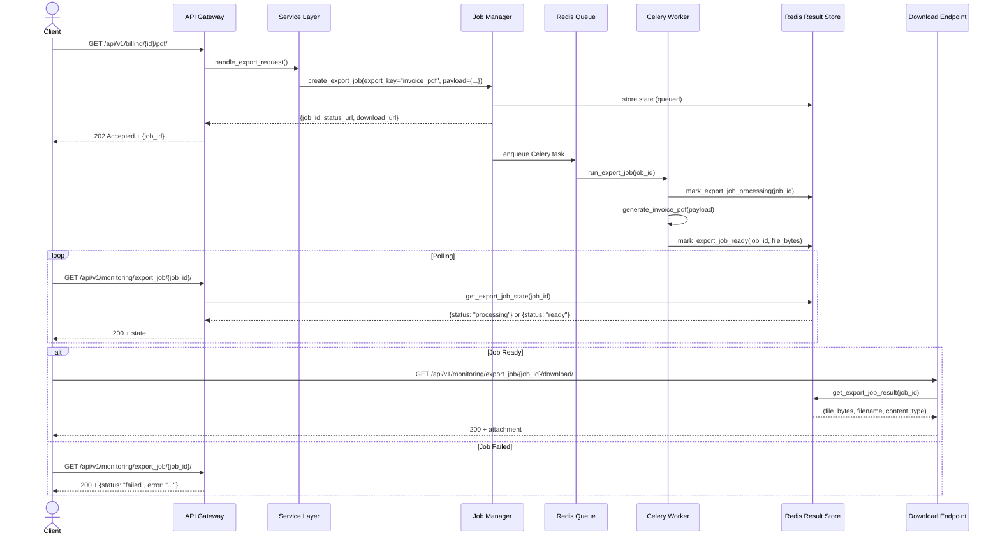

# Design do Fluxo Assíncrono Refatorizado – Sprint 1

**Versão**: 1.0  
**Data**: 2026-05-20  
**Status**: 🔄 Em Revisão  
**Owner**: Backend Squad

---

## 1. Visão Geral

O Sprint 1 refatora todos os endpoints de exportação para operar **exclusivamente em modo assíncrono**, removendo fallbacks síncronos e garantindo latência previsível na API.

### Antes (Status Atual)

```
GET /api/v1/billing/{id}/pdf/?async=true
├─ Se async=true → 202 (job queued)
└─ Se async=false (default) → 200 (arquivo + bloqueio)  ⚠️ Problem
```

### Depois (Target)

```
GET /api/v1/billing/{id}/pdf/
├─ Sempre → 202 (job queued)  ✅ Previsível
└─ Polling em /api/v1/monitoring/export_job/{job_id}/
```

---

## 2. Arquitetura do Fluxo



---

## 3. Estrutura de Dados

### 3.1 Job State (Redis Key: `export_job:state:{job_id}`)

```json
{
  "id": "a1b2c3d4-e5f6-7890-abcd-ef1234567890",
  "export_key": "invoice_pdf",
  "status": "queued|processing|ready|failed",
  "tenant_id": "tenant-123",
  "user_id": 42,
  "content_disposition": "inline|attachment",
  "created_at": "2026-05-20T10:30:00+02:00",
  "updated_at": "2026-05-20T10:30:05+02:00",
  "started_at": "2026-05-20T10:30:02+02:00",
  "finished_at": "2026-05-20T10:30:05+02:00",
  "filename": "invoice_2026-05-20.pdf",
  "content_type": "application/pdf",
  "error": null
}
```

### 3.2 Job Payload (Redis Key: `export_job:payload:{job_id}`)

```json
{
  "invoice_id": 123,
  "include_details": true,
  "language": "pt-PT"
}
```

### 3.3 Job Result (Redis Key: `export_job:result:{job_id}`)

```python
# Tupla (bytes, filename, content_type) serializada
(
  b"<PDF binary content>",
  "invoice_2026-05-20.pdf",
  "application/pdf"
)
```

---

## 4. API Contracts

### 4.1 Enqueue (POST → 202 Accepted)

**Request**:

```http
GET /api/v1/billing/123/pdf/
Authorization: Bearer {token}
X-Export-Disposition: attachment
```

**Response (202 Accepted)**:

```json
{
  "job_id": "a1b2c3d4-e5f6-7890-abcd-ef1234567890",
  "status": "queued",
  "export_key": "invoice_pdf",
  "created_at": "2026-05-20T10:30:00+02:00",
  "status_url": "http://localhost:8000/api/v1/monitoring/export_job/a1b2c3d4-e5f6-7890-abcd-ef1234567890/",
  "download_url": "http://localhost:8000/api/v1/monitoring/export_job/a1b2c3d4-e5f6-7890-abcd-ef1234567890/download/"
}
```

### 4.2 Status Polling (GET → 200 OK)

**Request**:

```http
GET /api/v1/monitoring/export_job/a1b2c3d4-e5f6-7890-abcd-ef1234567890/
Authorization: Bearer {token}
```

**Response (Processing)**:

```json
{
  "id": "a1b2c3d4-e5f6-7890-abcd-ef1234567890",
  "status": "processing",
  "export_key": "invoice_pdf",
  "created_at": "2026-05-20T10:30:00+02:00",
  "started_at": "2026-05-20T10:30:02+02:00",
  "finished_at": null,
  "status_url": "...",
  "download_url": "..."
}
```

**Response (Ready)**:

```json
{
  "id": "a1b2c3d4-e5f6-7890-abcd-ef1234567890",
  "status": "ready",
  "export_key": "invoice_pdf",
  "created_at": "2026-05-20T10:30:00+02:00",
  "started_at": "2026-05-20T10:30:02+02:00",
  "finished_at": "2026-05-20T10:30:05+02:00",
  "filename": "invoice_2026-05-20.pdf",
  "content_type": "application/pdf",
  "status_url": "...",
  "download_url": "..."
}
```

**Response (Failed)**:

```json
{
  "id": "a1b2c3d4-e5f6-7890-abcd-ef1234567890",
  "status": "failed",
  "export_key": "invoice_pdf",
  "error": "Fatura não encontrada para exportação.",
  "created_at": "2026-05-20T10:30:00+02:00",
  "started_at": "2026-05-20T10:30:02+02:00",
  "finished_at": "2026-05-20T10:30:03+02:00"
}
```

### 4.3 Download (GET → 200 OK + File)

**Request**:

```http
GET /api/v1/monitoring/export_job/a1b2c3d4-e5f6-7890-abcd-ef1234567890/download/
Authorization: Bearer {token}
```

**Response (Success)**:

```
HTTP/1.1 200 OK
Content-Type: application/pdf
Content-Disposition: inline; filename="invoice_2026-05-20.pdf"
Content-Length: 45678

<PDF binary data>
```

**Response (Not Ready)**:

```json
HTTP/1.1 409 Conflict

{
  "detail": "Exportação ainda não está pronta.",
  "status": "processing",
  "error": null
}
```

**Response (Failed)**:

```json
HTTP/1.1 410 Gone

{
  "detail": "Exportação falhou.",
  "status": "failed",
  "error": "Fatura não encontrada para exportação."
}
```

---

## 5. Lógica de Segurança & Autorização

### 5.1 Controle de Acesso

```python
def can_access_export_job(
    state: dict,
    tenant_id: str,
    user_id: int,
    is_superuser: bool
) -> bool:
    """
    Apenas o usuário que criou o job pode baixar (exceto superuser).
    Tenant isolation obrigatório.
    """
    # Tenant mismatch → acesso negado
    if state.get("tenant_id") != str(tenant_id):
        return False

    # Superuser → acesso sempre permitido
    if is_superuser:
        return True

    # User normal → apenas seu próprio job
    return state.get("user_id") == user_id
```

### 5.2 Content Disposition

**Header `X-Export-Disposition`**:

- `inline` (default) – download/visualizar diretamente
- `attachment` – força download

```python
disposition = request.headers.get("X-Export-Disposition", "inline")
if disposition not in {"inline", "attachment"}:
    disposition = "inline"  # Sanitize
```

---

## 6. Tratamento de Erros & Retry

### 6.1 Estratégia de Retry

```python
@shared_task(bind=True, max_retries=3)
def run_export_job(self, job_id: str):
    try:
        # ... processamento ...
    except Exception as exc:
        # Backoff exponencial: 60s, 300s, 900s
        retry_in = (60 * (2 ** self.request.retries))
        self.retry(exc=exc, countdown=retry_in)
```

### 6.2 Classificação de Erros

| Erro               | Tipo           | Retry       | Ação             |
| ------------------ | -------------- | ----------- | ---------------- |
| DB connection      | Transient      | ✅ Sim      | Retry automático |
| Payload validation | Client         | ❌ Não      | Mark failed      |
| Out of memory      | System         | ⚠️ Sim (1x) | Alert ops        |
| Timeout (> 5min)   | Infrastructure | ❌ Não      | Mark failed      |

---

## 7. Monitoramento & Observabilidade

### 7.1 Métricas (Prometheus)

```python
# Duração do job
observe_async_task_duration(
    metric_task_name=f"export:{export_key}",
    duration_seconds=elapsed,
    status="success|failed",
    tenant_id=tenant_id
)

# Labels:
# - export_type (invoice_pdf, activity_pdf, etc.)
# - tenant_id
# - status (queued, processing, ready, failed)
```

### 7.2 Alertas

```yaml
# Prometheus AlertManager

- alert: ExportJobStuck
  expr: increase(export_job_processing_seconds[30m]) == 0 and export_job_status{status="processing"} > 0
  for: 30m
  annotations:
    summary: "{{ $value }} export jobs stuck > 30 minutos"

- alert: ExportJobHighErrorRate
  expr: rate(export_job_errors[5m]) > 0.05
  for: 5m
  annotations:
    summary: "Taxa de erro de exports > 5%"
```

### 7.3 Logging Estruturado

```python
logger.info(
    "export_job_created",
    extra={
        "job_id": job_id,
        "export_key": export_key,
        "tenant_id": tenant_id,
        "user_id": user_id,
        "payload_size": len(json.dumps(payload)),
    }
)

logger.error(
    "export_job_failed",
    extra={
        "job_id": job_id,
        "export_key": export_key,
        "error": str(exc),
        "retry_count": retries,
    },
    exc_info=True
)
```

---

## 8. Performance & Capacidade

### 8.1 Limitações

| Aspecto                   | Limite    | Razão               |
| ------------------------- | --------- | ------------------- |
| Tamanho máximo de payload | 100 MB    | Redis memory        |
| Tamanho máximo de arquivo | 500 MB    | Network transfer    |
| TTL de job                | 1 hora    | Storage cleanup     |
| Max retries               | 3         | Resiliência         |
| Timeout por job           | 5 minutos | Worker availability |

### 8.2 Throttling

```python
# Por usuário:
# Max 10 jobs simultâneos (concurrent)
# Max 100 jobs por hora (rate limit)

# Por tenant:
# Max 50 jobs simultâneos
# Max 500 jobs por hora
```

### 8.3 Escalabilidade

- **Horizontal**: N workers Celery processam jobs em paralelo
- **Storage**: Redis com replicação; fallback em memória
- **API**: Stateless, escalável com load balancer
- **Throughput**: ~1000 jobs/hora com 4 workers (P95 latency: 2s enqueue + 6s processing)

---

## 9. Ciclo de Vida Detalhado

### 9.1 Estados e Transições

```
[queued]
    ↓
    └─→ Celery task enqueued

[queued] → [processing]
    ↓
    └─→ Worker inicia processamento

[processing] → [ready] ✅
    ↓
    └─→ Arquivo gerado e armazenado
    └─→ User pode fazer download
    └─→ Job expira em 1 hora (TTL)

[processing] → [failed] ❌
    ↓
    └─→ Erro irreversível
    └─→ Job retém estado por 1 hora (histórico)

[queued|processing|ready|failed] → [expired] ⏱️
    ↓
    └─→ TTL expirou
    └─→ Redis keys deletadas automaticamente
```

### 9.2 Datas Importantes

```python
# created_at: quando job foi criado
# started_at: quando worker iniciou
# finished_at: quando processamento terminou (sucesso ou erro)
# expires_at: quando job sairá de memória (implicit, derivado de created_at + TTL)
```

---

## 10. Plano de Implementação

### 10.1 Refactor por Endpoint

#### Exemplo: ExportPatientsCSV

**Antes (Síncrono)**:

```python
# api/exports/patients_csv.py
class ExportPatientsCSV(APIView):
    def get(self, request):
        response = HttpResponse(content_type="text/csv")
        writer = csv.writer(response)
        for patient in Patient.objects.all():
            writer.writerow([patient.id, patient.name])
        return response
```

**Depois (Assíncrono)**:

```python
# api/exports/patients_csv.py
from services.reports.async_exports import create_export_job
from tasks.export_jobs import run_export_job

class ExportPatientsCSV(APIView):
    permission_classes = [IsAuthenticated]

    def get(self, request):
        tenant = getattr(request, "tenant")
        user = getattr(request, "user")

        payload = {
            "tenant_id": tenant.id,
            "filters": request.query_params.dict()
        }

        job_state = create_export_job(
            export_key="patients_csv",
            payload=payload,
            tenant_id=tenant.id,
            user_id=user.id,
            content_disposition="attachment"
        )

        run_export_job.delay(job_state["id"])

        return Response({
            "job_id": job_state["id"],
            "status": "queued",
            "status_url": request.build_absolute_uri(
                f"/api/v1/monitoring/export_job/{job_state['id']}/"
            ),
            "download_url": request.build_absolute_uri(
                f"/api/v1/monitoring/export_job/{job_state['id']}/download/"
            ),
        }, status=202)
```

**Nova Task (Celery)**:

```python
# tasks/export_jobs.py
def _patients_csv(payload: dict) -> tuple[bytes, str, str]:
    from services.exports.patients import generate_patients_csv
    return generate_patients_csv(payload)

# Adicionar ao EXPORT_RUNNERS:
EXPORT_RUNNERS["patients_csv"] = _patients_csv
```

**Novo Service**:

```python
# services/exports/patients.py
import csv
from io import StringIO

def generate_patients_csv(payload: dict) -> tuple[bytes, str, str]:
    output = StringIO()
    writer = csv.writer(output)
    writer.writerow(["ID", "Name", "Email"])

    # Query otimizada (select_related, prefetch_related, etc.)
    patients = Patient.objects.select_related("tenant").filter(
        tenant_id=payload.get("tenant_id"),
        deleted=False
    ).values_list("id", "name", "email")

    for patient_id, name, email in patients.iterator(chunk_size=1000):
        writer.writerow([patient_id, name, email])

    csv_bytes = output.getvalue().encode("utf-8")
    return csv_bytes, "patients.csv", "text/csv"
```

---

## 11. Testes Necessários

### 11.1 Unitários

```python
# tests/test_export_jobs.py

def test_patients_csv_generator():
    payload = {"tenant_id": 1}
    csv_bytes, filename, content_type = _patients_csv(payload)

    assert filename == "patients.csv"
    assert content_type == "text/csv"
    assert b"ID,Name,Email" in csv_bytes

def test_invoice_pdf_with_missing_invoice():
    with pytest.raises(ValueError):
        _invoice_pdf({"invoice_id": 99999})
```

### 11.2 Integração (Celery)

```python
# tests/test_export_job_lifecycle.py

@pytest.mark.django_db
def test_export_job_queued_to_ready():
    # 1. Create job
    job_state = create_export_job(
        export_key="patients_csv",
        payload={},
        tenant_id=1,
        user_id=1
    )

    assert job_state["status"] == "queued"

    # 2. Execute Celery task (eager mode in test)
    run_export_job(job_state["id"])

    # 3. Verify state changed
    final_state = get_export_job_state(job_state["id"])
    assert final_state["status"] == "ready"
    assert final_state["filename"] is not None

    # 4. Verify result exists
    result = get_export_job_result(job_state["id"])
    assert result is not None
```

### 11.3 E2E (API)

```python
# tests/test_export_endpoints_e2e.py

@pytest.mark.django_db
def test_export_patients_csv_async(api_client):
    # 1. Request export
    response = api_client.get("/api/exports/patients/csv/")
    assert response.status_code == 202
    data = response.json()
    job_id = data["job_id"]

    # 2. Poll status
    status_response = api_client.get(f"/api/v1/monitoring/export_job/{job_id}/")
    assert status_response.status_code == 200

    # 3. Download (after task completes in eager mode)
    download_response = api_client.get(f"/api/v1/monitoring/export_job/{job_id}/download/")
    assert download_response.status_code == 200
    assert "text/csv" in download_response["Content-Type"]
```

---

## 12. Documentação de Cliente

### 12.1 SDK TypeScript (Frontend)

```typescript
// lib/api/export-client.ts

export class ExportClient {
  async requestExport(
    endpoint: string,
    params?: Record<string, any>,
  ): Promise<{ jobId: string; statusUrl: string; downloadUrl: string }> {
    const response = await fetch(endpoint + queryString(params), {
      headers: { Authorization: `Bearer ${token}` },
    });

    if (response.status === 202) {
      return response.json();
    }
    throw new Error("Export request failed");
  }

  async pollStatus(jobId: string): Promise<ExportStatus> {
    // Poll /api/v1/monitoring/export_job/{jobId}/ until ready
    // with exponential backoff: 500ms, 1s, 2s, 5s, 10s
  }

  async downloadFile(jobId: string, filename: string): Promise<Blob> {
    // GET /api/v1/monitoring/export_job/{jobId}/download/
  }
}
```

### 12.2 Exemplo de Uso

```typescript
// Example: Export patient list as CSV

const exporter = new ExportClient(baseURL, token);

// Step 1: Request export (returns 202)
const { jobId, downloadUrl } = await exporter.requestExport(
  "/api/exports/patients/csv/",
  { format: "csv", limit: 1000 },
);

// Step 2: Poll with UI feedback
let status = "queued";
while (status !== "ready") {
  await new Promise((r) => setTimeout(r, 1000)); // Wait 1s
  const jobState = await exporter.pollStatus(jobId);
  status = jobState.status;

  if (status === "processing") {
    ui.showProgress("Gerando arquivo...");
  } else if (status === "failed") {
    ui.showError(jobState.error);
    return;
  }
}

// Step 3: Download file
await exporter.downloadFile(jobId, "patients.csv");
ui.showSuccess("Download completo!");
```

---

## 13. Rollback & Fallback

### 13.1 Feature Flag

```python
# settings.py
EXPORT_ASYNC_ENABLED = env.bool("EXPORT_ASYNC_ENABLED", default=True)

# views.py
if not settings.EXPORT_ASYNC_ENABLED:
    # Fallback síncrono (deprecated)
    return legacy_sync_export(request, export_key, payload)
```

### 13.2 Canary Deployment

Fases de rollout:

1. **Shadow mode** (0% tráfego assíncrono, 100% síncrono) – validate setup
2. **10% tráfego** – monitor error rate
3. **50% tráfego** – check SLOs
4. **100% tráfego** – full rollout
5. **Deprecate síncrono** – remove fallback

---

## 14. Checklist de Validação (Go/No-Go)

- [ ] Todos endpoints mapeados (audit completo)
- [ ] Tasks Celery implementadas e testadas
- [ ] ExportJob storage funcional (Redis + fallback)
- [ ] API contracts definidos (OpenAPI)
- [ ] Testes unitários: 80%+ cobertura
- [ ] Testes e-to-e: success + error paths
- [ ] Alerts configurados (job stuck, high error rate)
- [ ] Runbook escrito (troubleshooting)
- [ ] SDK TypeScript atualizado
- [ ] Feature flag implementada
- [ ] Docs atualizadas
- [ ] Load test: 1000 jobs/hora, p95 latency <= 8s
- [ ] Rollback plan testado

---

## Referências

- **SLA/SLO**: `docs/engineering_quality.md`
- **Async Exports (atual)**: `docs/async_exports.md`
- **Export Audit**: `docs/export_audit.md`
- **Roadmap**: `docs/roadmap_2026.md`

## Alinhamento com beta e produção

**Última revisão documental:** 2026-05-30.

**Propósito no projecto.** Orienta a migração de exportações e relatórios para processamento assíncrono.

**Valor que protege.** Protege disponibilidade da API, experiência do utilizador e previsibilidade de relatórios pesados.

**Como usar na implementação.**
1. Ler este documento antes de alterar modelos, serializers, viewsets, tarefas, páginas, contratos ou prompts relacionados.
2. Confirmar impacto em tenant, RBAC, auditoria, dados sensíveis, jobs assíncronos, PDFs, eventos e experiência do utilizador.
3. Actualizar testes, schemas, runbooks e documentação no mesmo ciclo da alteração.
4. Registar dívida técnica remanescente com owner, impacto e prazo.

**Até produção beta.** Deve cobrir estados de job, retry, polling, erros, permissões e migração de endpoints síncronos.

**Para production-ready.** Exige métricas de fila, alertas de jobs presos, DLQ, idempotência e limpeza de artefactos.
